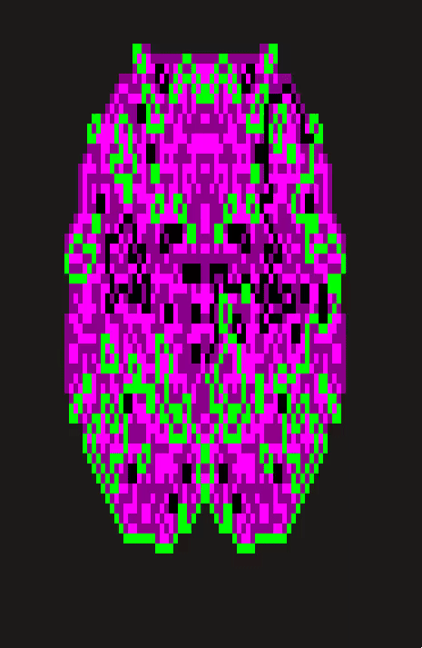
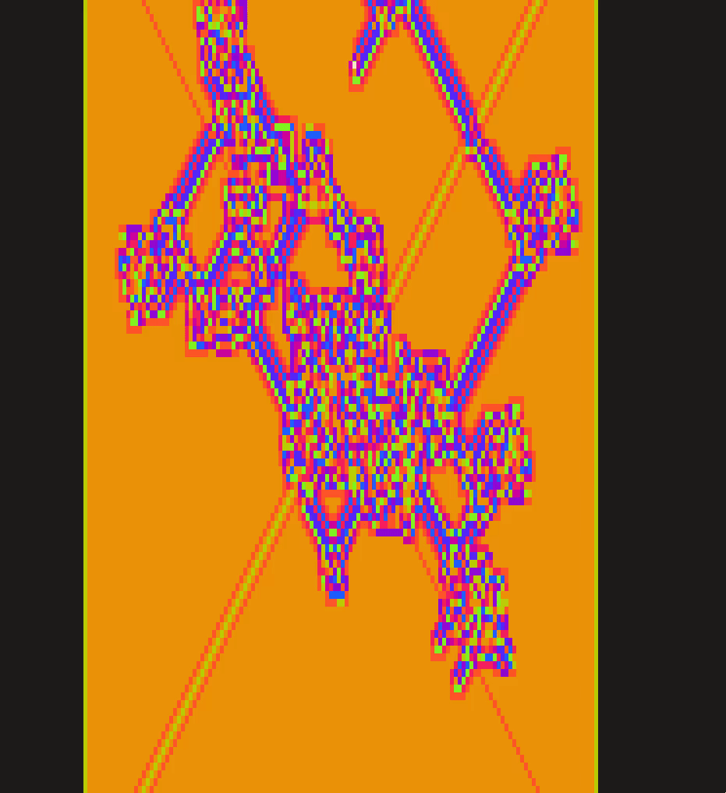

# Cellular critters

## Running
Run `yarn && node turmite.js` in a true-color compatible terminal (check [here](https://gist.github.com/XVilka/8346728)). There's a few different recipes for different n-color Langton's ants in there, you can tweak it at the bottom of the file.

## Samples
### Spaceship

### Raygun

### Key

### Amber

